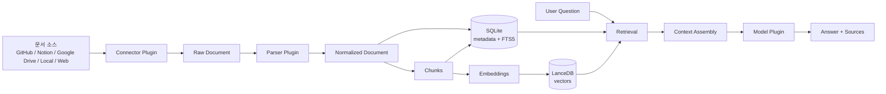
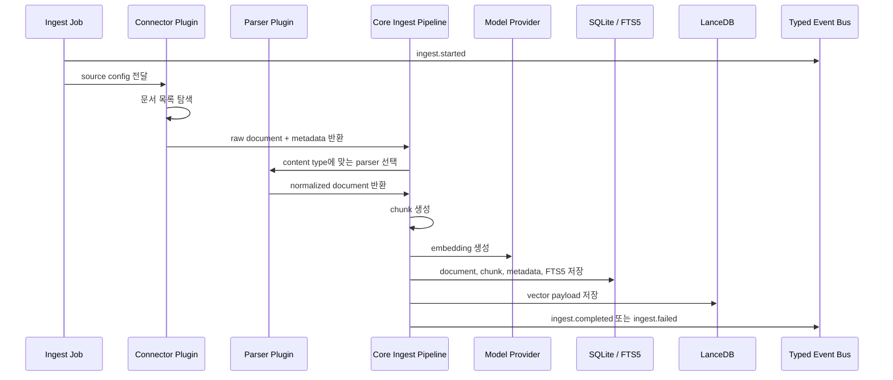
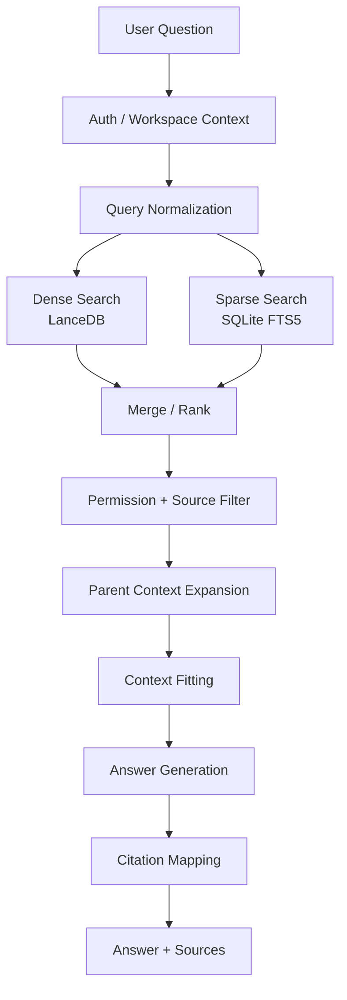
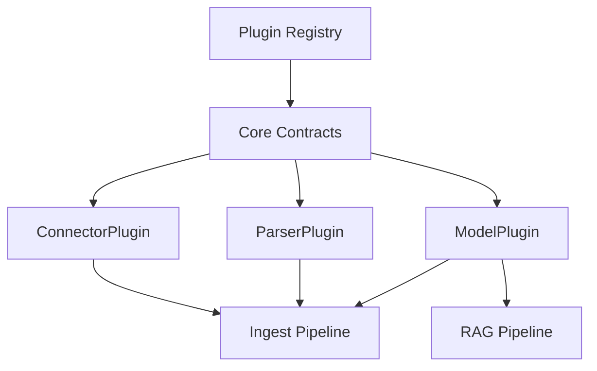
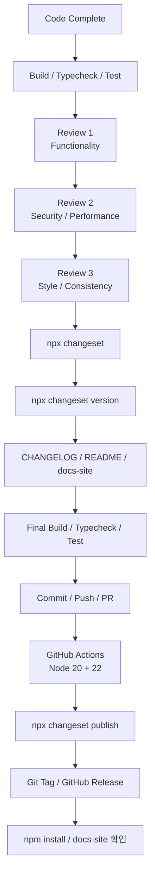

# OpenDocuments 세부 파이프라인

이 문서는 OpenDocuments의 핵심 실행 흐름을 운영 관점에서 정리한다. 범위는 문서 인덱싱, 질문 응답 RAG, 릴리즈 파이프라인이다.

관련 문서:

- [아키텍처 개요](architecture.ko.md)
- [Architecture](architecture.md)

## 전체 흐름

OpenDocuments의 런타임은 외부 문서를 검색 가능한 지식 베이스로 변환한 뒤, 사용자 질문에 대해 검색된 근거를 바탕으로 답변을 생성한다.



핵심 원칙은 다음과 같다.

- 비즈니스 로직은 `packages/core`에 둔다.
- 외부 시스템, 파일 형식, 모델 제공자는 플러그인으로 분리한다.
- 답변은 검색된 chunk와 source metadata를 근거로 생성한다.
- 사용자 입력 기반 검색 조건은 반드시 안전한 helper를 거친다.

## 1. 문서 인덱싱 파이프라인

문서 인덱싱 파이프라인은 외부 소스의 문서를 가져와 SQLite와 LanceDB에 저장 가능한 검색 단위로 변환한다.



### 1.1 입력

인덱싱의 입력은 source configuration과 인증 정보다.

| 입력 | 예시 | 담당 |
| --- | --- | --- |
| Source config | repository, Drive folder, Notion database, local path | CLI / server / config loader |
| Credentials | API key, OAuth token, service account | auth / connector config |
| Workspace context | `workspace_id`, team mode state | core / server |
| Plugin registry | connector, parser, model provider 목록 | core plugin system |

시크릿은 코드에 하드코딩하지 않고 환경변수나 안전한 설정 채널로 주입한다.

### 1.2 Connector 단계

Connector는 외부 소스별 차이를 숨기고 공통 raw document 형태로 변환한다.

담당 패키지:

- `plugins/connector-github`
- `plugins/connector-notion`
- `plugins/connector-gdrive`
- `plugins/connector-s3`
- `plugins/connector-confluence`
- `plugins/connector-slack`
- `plugins/connector-web-crawler`
- `plugins/connector-web-search`
- `plugins/connector-swagger`

주요 책임:

- 문서 목록 탐색
- 원본 콘텐츠 가져오기
- source path, external id, updated time, MIME type 수집
- 삭제되었거나 변경된 문서 감지
- rate limit과 외부 API 실패 처리

출력은 parser가 처리할 수 있는 raw content와 metadata다.

### 1.3 Parser 단계

Parser는 파일 형식별 원본 콘텐츠를 텍스트와 구조 정보로 변환한다.

담당 패키지:

- `plugins/parser-pdf`
- `plugins/parser-docx`
- `plugins/parser-xlsx`
- `plugins/parser-html`
- `plugins/parser-jupyter`
- `plugins/parser-email`
- `plugins/parser-code`
- `plugins/parser-pptx`

주요 책임:

- 텍스트 추출
- 제목, heading, page, slide, sheet, code block 같은 구조 보존
- 검색에 불필요한 binary payload 제거
- 파싱 실패 시 actionable error 반환

출력은 normalized document다.

```text
Raw document
  -> Parser
  -> title
  -> body text
  -> structured sections
  -> source metadata
  -> content hash
```

### 1.4 정규화 단계

Core ingest pipeline은 connector와 parser 출력물을 내부 document model로 맞춘다.

정규화 시 유지해야 하는 정보:

- `workspace_id`
- source type
- source id 또는 external id
- source path
- title
- content hash
- modified time
- parser metadata
- access scope

이 단계에서 같은 문서의 중복 인덱싱을 막고, 변경 여부를 판단할 수 있어야 한다.

### 1.5 Chunking 단계

Chunking은 긴 문서를 검색과 LLM context에 적합한 단위로 나눈다.

주요 기준:

- heading, section, paragraph 같은 구조 경계를 우선한다.
- code block은 가능한 한 의미 단위로 유지한다.
- chunk에는 원본 문서와 위치 정보를 남긴다.
- citation에 필요한 source path와 section 정보를 보존한다.

출력 예:

```text
Document
  -> Chunk 1: title + intro
  -> Chunk 2: heading A body
  -> Chunk 3: heading B code block
  -> Chunk 4: appendix
```

### 1.6 Embedding 단계

Embedding 단계는 chunk text를 vector로 변환한다.

담당 패키지:

- `plugins/model-ollama`
- `plugins/model-openai`
- `plugins/model-anthropic`
- `plugins/model-google`
- `plugins/model-grok`

주의사항:

- 모델 provider가 없어도 개발 모드에서는 stub model fallback으로 동작할 수 있어야 한다.
- embedding 실패는 조용히 삼키지 말고 job failure 또는 partial failure로 기록한다.
- provider별 API key는 환경변수 또는 안전한 config를 통해 전달한다.

### 1.7 저장 단계

OpenDocuments는 SQLite와 LanceDB를 역할별로 나누어 사용한다.

| 저장소 | 데이터 | 목적 |
| --- | --- | --- |
| SQLite | workspace, document, chunk, job, auth metadata | 구조화 데이터와 상태 관리 |
| SQLite FTS5 | chunk text, title, source path | keyword search |
| LanceDB | embedding vector, chunk payload | semantic search |

보안 규칙:

- SQL은 parameterized statement를 사용한다.
- FTS5 검색에는 raw user input을 직접 넣지 않고 `escapeFTS5Query()`를 사용한다.
- LanceDB 필터는 raw string interpolation 대신 `buildWhereClause()`를 사용한다.

### 1.8 이벤트와 관측성

Core 컴포넌트 간 통신은 TypedEventBus를 통해 이루어진다.

권장 이벤트 흐름:

```text
ingest.started
  -> document.discovered
  -> document.parsed
  -> chunk.created
  -> embedding.created
  -> document.indexed
  -> ingest.completed
```

실패 시에는 최소한 다음 정보를 남긴다.

- workspace
- source type
- document id 또는 source path
- 실패 단계
- 사용자에게 줄 수 있는 복구 방법

프로덕션 사용자 응답에는 stack trace나 내부 filesystem path를 노출하지 않는다.

## 2. 질문 응답 RAG 파이프라인

RAG 파이프라인은 사용자 질문을 검색 쿼리로 변환하고, 관련 chunk를 찾아 LLM 답변과 출처를 생성한다.



### 2.1 진입점

질문은 여러 인터페이스에서 들어올 수 있다.

| 진입점 | 담당 패키지 | 역할 |
| --- | --- | --- |
| CLI | `packages/cli` | 명령어 기반 질의 |
| HTTP API | `packages/server` | Hono API endpoint |
| Web UI | `packages/web` | React SPA |
| SDK | `packages/client` | TypeScript client |
| MCP Server | `packages/server` | AI assistant 연동 |

server는 프로토콜 변환 레이어이며, 검색과 답변 생성의 핵심 로직은 core에 둔다.

### 2.2 인증과 workspace context

team mode에서는 HTTP endpoint가 반드시 auth middleware로 보호되어야 한다.

확인해야 할 정보:

- API key 또는 session
- workspace 권한
- 요청자가 접근 가능한 source 범위
- rate limit 또는 quota

인증 실패는 내부 정보를 노출하지 않는 명확한 사용자 메시지로 반환한다.

### 2.3 Query normalization

질문은 검색에 적합한 형태로 정규화된다.

처리 예:

- 불필요한 공백 정리
- workspace/source filter 결합
- keyword search용 escape 처리
- embedding query 생성
- 필요한 경우 multi-query 또는 HyDE 생성

FTS5에는 반드시 `escapeFTS5Query()`를 거친 문자열만 전달한다.

### 2.4 Retrieval

Retrieval은 dense search와 sparse search를 함께 사용할 수 있다.

Dense search:

- LanceDB에서 embedding vector similarity 검색
- 의미적으로 유사한 chunk 탐색
- natural language 질문에 강함

Sparse search:

- SQLite FTS5 기반 keyword search
- 정확한 용어, 파일명, symbol, error text 검색에 강함

Hybrid search:

- dense 결과와 sparse 결과를 병합한다.
- 중복 chunk는 합친다.
- score와 rank를 기준으로 상위 후보를 만든다.

### 2.5 Filtering과 ranking

검색 결과는 답변 생성 전에 필터링된다.

필터 기준:

- workspace 일치 여부
- 권한 범위
- source type
- document freshness
- duplicate chunk
- 낮은 score

Ranking 단계에서는 결과 순서를 보정한다. 필요한 경우 RRF, reranker, metadata boost를 적용할 수 있다.

### 2.6 Context assembly

선택된 chunk는 LLM prompt에 들어갈 context로 조립된다.

context에 포함해야 할 정보:

- chunk text
- document title
- source path
- section 또는 page 정보
- updated time
- citation id

Context fitting은 모델 context window를 넘지 않도록 chunk를 줄이거나 우선순위를 조정한다.

### 2.7 Answer generation

Model plugin이 context와 질문을 받아 답변을 생성한다.

답변 생성 규칙:

- 검색된 context에 근거해서 답한다.
- 근거가 부족하면 부족하다고 말한다.
- 출처를 함께 반환한다.
- 내부 stack trace, API key, local path 같은 민감 정보는 포함하지 않는다.

### 2.8 Citation mapping

답변에 포함되는 출처는 chunk metadata에서 생성한다.

출처에 포함할 수 있는 정보:

- source type
- document title
- source path 또는 URL
- page, slide, section
- chunk id

Citation은 사용자가 원문을 찾아갈 수 있을 정도로 구체적이어야 한다.

## 3. 플러그인 실행 파이프라인

OpenDocuments의 확장 지점은 connector, parser, model provider다.



플러그인 추가 시 확인할 항목:

- `coreVersion: '^0.1.0'` 호환성 유지
- public API에 JSDoc 작성
- ESM import에 `.js` 확장자 포함
- `any` 대신 `unknown` 또는 명시적 타입 사용
- happy path와 error path 테스트 추가
- 외부 API 호출은 테스트에서 `vi.stubGlobal('fetch', ...)`로 mock

## 4. 릴리즈 파이프라인

릴리즈는 changesets 기반으로 수행한다.



### 4.1 코드 준비

릴리즈 전에 전체 검증을 실행한다.

```bash
npm run build
npm run typecheck
npm run test
```

### 4.2 3회 코드 리뷰

1차 리뷰는 기능과 정확성을 확인한다.

- 변경된 파일의 로직 확인
- edge case 확인
- error handling 확인
- 새 기능 테스트 확인

2차 리뷰는 보안과 성능을 확인한다.

- SQL injection 가능성
- raw FTS5 query 사용 여부
- raw LanceDB filter interpolation 여부
- API key 또는 secret 하드코딩 여부
- 불필요한 `any` 사용 여부
- N+1 query 또는 불필요한 loop

3차 리뷰는 스타일과 일관성을 확인한다.

- naming convention
- ESM import의 `.js` 확장자
- CLI output의 `log` 유틸리티 사용
- public API JSDoc
- 불필요한 `console.log`, TODO, debugging code 제거

### 4.3 Changeset 생성

```bash
npx changeset
```

선택 항목:

- 영향 받는 package
- bump type: patch, minor, major
- 변경 요약

생성된 `.changeset/*.md` 파일은 커밋에 포함한다.

### 4.4 버전 범프

```bash
npx changeset version
```

이 명령은 package version, workspace dependency version, `CHANGELOG.md`를 업데이트한다.

### 4.5 문서 보완

릴리즈 내용에 따라 다음 문서를 확인한다.

- `README.md`
- `README.ko.md`
- `CHANGELOG.md`
- `docs-site/guide/*`
- `docs-site/plugins/*`
- `docs-site/api/*`

특히 새 플러그인, CLI 명령어, MCP 도구 수, 테스트 수가 바뀌면 문서에 반영한다.

### 4.6 최종 검증

```bash
npm run build && npm run typecheck && npm run test
```

모든 검증이 통과한 뒤 release commit을 만든다.

```bash
git add -A
git commit -m "chore: release v{VERSION}"
git push origin {branch}
```

### 4.7 배포와 릴리즈

CI가 통과하고 PR이 main에 merge된 뒤 npm 배포를 실행한다.

```bash
npx changeset publish
```

배포 후 확인:

```bash
npm info opendocuments
npm info opendocuments-core
npm install -g opendocuments@latest
```

마지막으로 태그와 GitHub Release를 만든다.

```bash
git tag v{VERSION}
git push origin v{VERSION}
```

## 5. 장애 처리 체크리스트

문제가 발생하면 먼저 어느 단계에서 실패했는지 분리한다.

| 증상 | 우선 확인 단계 |
| --- | --- |
| 문서가 검색되지 않음 | connector, parser, chunk 저장, FTS5 index |
| 의미 검색 결과가 이상함 | embedding provider, LanceDB payload, vector dimension |
| 키워드 검색이 실패함 | FTS5 query escaping, tokenization, chunk text |
| 답변에 출처가 없음 | citation mapping, chunk metadata |
| 권한 없는 문서가 보임 | auth middleware, workspace filter, source filter |
| 배포 후 package 버전 불일치 | changeset version, workspace dependency, npm publish 결과 |

장애 로그에는 원인 분석에 필요한 단계 정보는 남기되, 사용자 응답에는 내부 경로나 stack trace를 노출하지 않는다.

## 6. 구현 변경 시 체크포인트

새 기능이나 수정이 파이프라인에 영향을 주는 경우 다음을 확인한다.

- core 로직에 들어갈 변경인지, plugin에 들어갈 변경인지 분리한다.
- HTTP endpoint를 추가하면 team mode auth middleware를 적용한다.
- SQL은 parameterized statement를 사용한다.
- FTS5 query는 `escapeFTS5Query()`를 사용한다.
- LanceDB filter는 `buildWhereClause()`를 사용한다.
- CLI output에는 이모지 대신 `log.ok`, `log.fail`, `log.info`, `log.arrow`, `log.wait`를 사용한다.
- TypeScript import에는 `.js` 확장자를 포함한다.
- 테스트는 happy path와 error path를 모두 포함한다.
- 외부 API는 Vitest에서 mock 처리한다.
